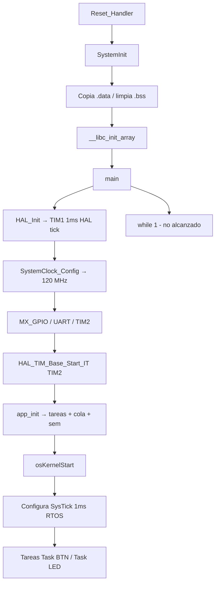

# CESE - Sistemas Operativos de Tiempo Real

## Trabajo Practico N°: 2 - Comunicacion de Tareas de FreeRTOS

> **Nota sobre archivos de la guia:** la consigna original cita `startup_stm32f103rbtx.s`, `stm32f1xx_it.c` (NUCLEO-F103).  
> Este proyecto del grupo usa **STM32L4R5ZI** (NUCLEO-L4R5ZI). Los archivos equivalentes analizados son:
>
>
> | Guia (F103)               | Proyecto real (L4R5)                                            |
> | ------------------------- | --------------------------------------------------------------- |
> | `startup_stm32f103rbtx.s` | `Core/Startup/startup_stm32l4r5zitx.s`                          |
> | `stm32f1xx_it.c`          | `Core/Src/stm32l4xx_it.c`                                       |
> | `main.c`                  | `Core/Src/main.c`                                               |
> | `FreeRTOSConfig.h`        | `Core/Inc/FreeRTOSConfig.h`                                     |
> | `freertos.c`              | `Core/Src/freertos.c` (+ hooks fuertes en `APP/src/freertos.c`) |
>
>
> **Nota sobre TIM1 / TIM2 en la consigna:** el texto de la guia mezcla nombres (*"Timer 1 (TIM2)"*, *"Timer 2 (TIM2)"*).  
> En **este** firmware la asignacion verificada es:
>
> - **SysTick** → tick del kernel **FreeRTOS** (1 ms).
> - **TIM1** → timebase de la **HAL** (`uwTick`, 1 ms).
> - **TIM2** → contador de alta frecuencia para **run-time stats** de FreeRTOS (`ulHighFrequencyTimerTicks`).

---

## 1) Analisis y explicacion del codigo fuente base (Core)

### 1.1 Funcionamiento general de los archivos Core

#### `startup_stm32l4r5zitx.s`

Es el **vector de interrupciones** y el **punto de entrada** tras reset del Cortex-M4.

Responsabilidades principales:

1. Tabla `g_pfnVectors`: apunta `_estack`, `Reset_Handler`, handlers de excepciones (NMI, HardFault, …) y de perifericos (TIM1, TIM2, EXTI, …).
2. `Reset_Handler`:
  - Configura SP (`_estack`).
  - Llama `SystemInit()` (FPU, VTOR si aplica).
  - Copia `.data` desde Flash a RAM.
  - Pone `.bss` en cero.
  - Llama `__libc_init_array()` (constructores estaticos C).
  - Llama `main()`.
3. Si `main()` retornara, cae en `LoopForever`.

En el vector aparecen entradas relevantes para este TP2:

- `SysTick_Handler` (pos. 15) — usado por FreeRTOS tras `osKernelStart()`.
- `TIM1_UP_TIM16_IRQHandler` — timebase HAL.
- `TIM2_IRQHandler` — contador run-time stats.
- `EXTI15_10_IRQHandler` — boton B1 (PC13).

#### `main.c`

Orquesta la inicializacion **antes** del scheduler:

```text
main()
  ├─ [opcional] initialise_monitor_handles()   (semihosting)
  ├─ HAL_Init()                                → HAL_InitTick() usa TIM1
  ├─ SystemClock_Config()                      → PLL, 120 MHz SYSCLK
  ├─ MX_GPIO_Init()                            → LED, boton EXTI, USB
  ├─ MX_LPUART1_UART_Init()
  ├─ MX_USART3_UART_Init()
  ├─ MX_TIM2_Init()                            → Prescaler=119, Period=99
  ├─ HAL_TIM_Base_Start_IT(&htim2)             → arranca TIM2 con IRQ
  ├─ app_init()                                → cola, semaforo, task_btn, task_led
  └─ osKernelStart()                           → arranca FreeRTOS (no retorna)
       └─ while(1) {}                          → codigo muerto si scheduler OK
```

`HAL_TIM_PeriodElapsedCallback()` discrimina instancia:

- **TIM1** → `HAL_IncTick()` incrementa `uwTick` (HAL, 1 ms).
- **TIM2** → `ulHighFrequencyTimerTicks++` (stats FreeRTOS).

Funciones auxiliares para stats (`configureTimerForRunTimeStats`, `getRunTimeCounterValue`) estan en `main.c` y se enlazan desde `FreeRTOSConfig.h`.

#### `stm32l4xx_it.c`

Capa de **vectores de interrupcion** que delega en HAL:


| Handler                           | Accion                                           |
| --------------------------------- | ------------------------------------------------ |
| Excepciones Cortex (HardFault, …) | Loop infinito / depuracion                       |
| `TIM1_UP_TIM16_IRQHandler`        | `HAL_TIM_IRQHandler(&htim1)` → callback HAL tick |
| `TIM2_IRQHandler`                 | `HAL_TIM_IRQHandler(&htim2)` → incremento stats  |
| `EXTI15_10_IRQHandler`            | `HAL_GPIO_EXTI_IRQHandler(B1_Pin)` → `app_it.c`  |


No contiene logica de aplicacion; solo despacha a HAL/callbacks.

#### `FreeRTOSConfig.h`

Parametriza el kernel para este proyecto:


| Define                                         | Valor             | Efecto en TP2                          |
| ---------------------------------------------- | ----------------- | -------------------------------------- |
| `configUSE_PREEMPTION`                         | 1                 | Scheduler preemptivo                   |
| `configTICK_RATE_HZ`                           | 1000              | Tick RTOS = 1 ms                       |
| `configCPU_CLOCK_HZ`                           | `SystemCoreClock` | Base para calcular SysTick             |
| `configTOTAL_HEAP_SIZE`                        | 15360             | Heap para tareas, colas, semaforos     |
| `configUSE_IDLE_HOOK`                          | 1                 | Hook idle activo (`APP/freertos.c`)    |
| `configUSE_TICK_HOOK`                          | 1                 | Hook tick activo                       |
| `configCHECK_FOR_STACK_OVERFLOW`               | 1                 | Deteccion desborde pila                |
| `configGENERATE_RUN_TIME_STATS`                | 1                 | Stats CPU por tarea                    |
| `INCLUDE_vTaskDelayUntil`                      | 1                 | Usado en `task_led`                    |
| `configLIBRARY_MAX_SYSCALL_INTERRUPT_PRIORITY` | 5                 | Limite IRQ que pueden usar API FromISR |
| `xPortSysTickHandler`                          | `SysTick_Handler` | FreeRTOS toma SysTick (HAL usa TIM1)   |


Macros de run-time stats:

```c
#define portCONFIGURE_TIMER_FOR_RUN_TIME_STATS configureTimerForRunTimeStats
#define portGET_RUN_TIME_COUNTER_VALUE         getRunTimeCounterValue
```

TIM2 alimenta esas macros con resolucion ~100 us (10 kHz).

#### `freertos.c` (Core)

Generado por CubeMX. Aporta:

- Stubs `__weak` de hooks y funciones de stats (sobreescritos en `APP/src/freertos.c`).
- `vApplicationGetIdleTaskMemory()` — **alloc estatica** de la tarea Idle (TCB + stack).

Las implementaciones reales de hooks estan en `APP/src/freertos.c`:

- `vApplicationIdleHook()` → `g_task_idle_cnt++`
- `vApplicationTickHook()` → `g_app_tick_cnt++`
- `vApplicationStackOverflowHook()` → `configASSERT(0)`

---

### 1.2 Evolucion de `SystemCoreClock` y SysTick (desde `Reset_Handler` hasta `while(1)` de `main`)

#### `SystemCoreClock`

Variable global CMSIS (`system_stm32l4xx.c`):

```c
uint32_t SystemCoreClock = 4000000U;  /* valor inicial tras reset (MSI 4 MHz tipico) */
```


| Etapa                             | Valor / accion                                                   | Archivo              |
| --------------------------------- | ---------------------------------------------------------------- | -------------------- |
| Reset                             | `4000000` (4 MHz, MSI por defecto)                               | `system_stm32l4xx.c` |
| `SystemInit()` en `Reset_Handler` | Configura FPU; **no** cambia PLL todavia                         | `system_stm32l4xx.c` |
| `HAL_Init()`                      | Llama `HAL_InitTick()`; usa `SystemCoreClock` vigente            | `main.c`             |
| `SystemClock_Config()`            | PLL: HSI 16 MHz → PLLM=2, PLLN=30, PLLR=2 → **SYSCLK = 120 MHz** | `main.c`             |
| Tras `HAL_RCC_ClockConfig()`      | `SystemCoreClock` actualizado automaticamente a **120000000**    | HAL RCC              |


Calculo PLL (verificado en `SystemClock_Config`):

```text
VCO_in  = HSI / PLLM = 16 MHz / 2 = 8 MHz
VCO_out = VCO_in * PLLN = 8 * 30 = 240 MHz
SYSCLK  = VCO_out / PLLR = 240 / 2 = 120 MHz
HCLK    = 120 MHz (AHB div 1)
PCLK1   = 60 MHz (APB1 div 2)  → TIM2 clock efectivo 120 MHz (x2 si APB prescaled)
PCLK2   = 120 MHz (APB2 div 1) → TIM1 clock 120 MHz
```

#### SysTick (periferico Cortex-M)


| Etapa                                          | Estado de SysTick                                                                                                                   |
| ---------------------------------------------- | ----------------------------------------------------------------------------------------------------------------------------------- |
| Tras reset                                     | No configurado (registros LOAD/VAL/CTRL en estado por defecto)                                                                      |
| Durante `HAL_Init()`                           | **No** se usa SysTick para HAL tick; CubeMX redirige tick HAL a **TIM1** (`stm32l4xx_hal_timebase_tim.c`)                           |
| Durante init perifericos                       | SysTick sigue sin rol activo en aplicacion                                                                                          |
| En `osKernelStart()` → `vTaskStartScheduler()` | Port FreeRTOS **configura SysTick** para interrumpir cada 1 ms (`configTICK_RATE_HZ = 1000`) usando `SystemCoreClock = 120 MHz`     |
| Tras arranque scheduler                        | `SysTick_Handler` (alias `xPortSysTickHandler`) incrementa tick RTOS; habilita `vTaskDelay`, `vTaskDelayUntil`, `xTaskGetTickCount` |


**Variable relacionada `uwTick` (HAL):** no es SysTick; es contador software incrementado en callback de **TIM1** cada 1 ms via `HAL_IncTick()`. Se usa en delays HAL (`HAL_Delay`) y base temporal HAL.

**Resumen temporal:**

```text
SystemCoreClock:  4 MHz ──SystemClock_Config()──► 120 MHz (permanece)
uwTick (HAL):       0 ──TIM1 IRQ cada 1 ms──────► 0, 1, 2, 3 …
SysTick (RTOS):   inactivo ──osKernelStart()──► tick 0, 1, 2 … (1 ms)
ulHighFrequencyTimerTicks: 0 ──TIM2 IRQ ~100 us──► contador rapido
```

---

### 1.3 Comportamiento del programa desde `Reset_Handler` hasta **antes** del `while(1)` de `main`

Secuencia detallada (sin scheduler aun):

```text
1. Reset hardware
   └─ CPU carga SP desde vector[0] y PC desde vector[1] = Reset_Handler

2. Reset_Handler (startup_stm32l4r5zitx.s)
   ├─ sp = _estack
   ├─ SystemInit()           → FPU, VTOR
   ├─ Copia .data Flash→RAM
   ├─ Limpia .bss = 0
   ├─ __libc_init_array()
   └─ main()

3. main() — fase bare-metal (aun no hay tareas RTOS)
   ├─ initialise_monitor_handles()  [si semihosting]
   ├─ HAL_Init()
   │    └─ HAL_InitTick() → configura TIM1 @ 1 ms, NVIC TIM1_UP_TIM16
   ├─ SystemClock_Config()
   │    └─ SystemCoreClock = 120 MHz; HAL_InitTick() reconfigura TIM1
   ├─ MX_GPIO_Init()        → LEDs, B1 como EXTI falling, prioridad IRQ 5
   ├─ MX_LPUART1 / MX_USART3
   ├─ MX_TIM2_Init()        → timer base 10 kHz (stats)
   ├─ HAL_TIM_Base_Start_IT(&htim2)
   │    └─ empiezan IRQ de TIM2 (ulHighFrequencyTimerTicks++)
   └─ app_init()
        ├─ Inicializa contadores globales (g_app_cnt, …)
        ├─ xQueueCreate(5, sizeof(task_led_ev_t))
        ├─ xSemaphoreCreateBinary()
        ├─ xTaskCreate(task_btn, … prio 1)
        ├─ xTaskCreate(task_led, … prio 1)
        ├─ app_it_init()
        └─ cycle_counter_init()

4. osKernelStart()
   ├─ Crea tarea Idle (memoria estatica en Core/freertos.c)
   ├─ Configura SysTick para tick 1 ms
   ├─ Arranca primera tarea lista (task_btn o task_led segun scheduler)
   └─ NO RETORNA a main()

5. while(1) en main → NO se alcanza en operacion normal
```

**Comportamiento observable antes del `while(1)`:**

- Reloj del sistema a **120 MHz**.
- **TIM1** generando interrupciones cada 1 ms (`uwTick` avanza).
- **TIM2** generando interrupciones cada ~100 us (`ulHighFrequencyTimerTicks` avanza).
- Tareas `Task BTN` y `Task LED` **creadas** en memoria/heap pero **aun no ejecutadas** hasta `osKernelStart()`.
- Cola y semaforo creados pero **no usados** aun por las tareas (comunicacion actual: variable compartida).

---

### 1.4 Como y para que interactuan SysTick y TIM1/TIM2 con FreeRTOS

La consigna mezcla numeracion; esta tabla refleja el **proyecto real**:


| Recurso     | Interaccion con FreeRTOS                                                                                                                                                | Para que                                                                                                                       |
| ----------- | ----------------------------------------------------------------------------------------------------------------------------------------------------------------------- | ------------------------------------------------------------------------------------------------------------------------------ |
| **SysTick** | El port Cortex-M configura SysTick al iniciar scheduler. Cada IRQ ejecuta el tick handler del kernel (`xPortSysTickHandler`).                                           | **Tick RTOS 1 ms**: `vTaskDelay`, `vTaskDelayUntil`, timeouts de colas/semaforos, `xTaskGetTickCount`, `vApplicationTickHook`  |
| **TIM1**    | **No** es tick de FreeRTOS. Convive en paralelo. FreeRTOS puede suspender/reanudar tick HAL con `HAL_SuspendTick`/`HAL_ResumeTick` en context switches (segun port ST). | **Timebase HAL** (`uwTick`): delays HAL, timeouts HAL. Libera SysTick para el kernel                                           |
| **TIM2**    | Con `configGENERATE_RUN_TIME_STATS = 1`, el kernel lee `getRunTimeCounterValue()` → `ulHighFrequencyTimerTicks`                                                         | **Run-time stats**: medir % CPU por tarea (Tracealyzer, `vTaskGetRunTimeStats`, debug). Resolucion ~100 us vs 1 ms del SysTick |


Cadena TIM2 → FreeRTOS stats:

```text
TIM2 IRQ (10 kHz)
  → TIM2_IRQHandler()
  → HAL_TIM_IRQHandler(&htim2)
  → HAL_TIM_PeriodElapsedCallback(TIM2)
  → ulHighFrequencyTimerTicks++
  → portGET_RUN_TIME_COUNTER_VALUE (en context switch / stats API)
```

Cadena SysTick → FreeRTOS:

```text
SysTick IRQ (1 kHz)
  → SysTick_Handler / xPortSysTickHandler
  → xTaskIncrementTick()
  → vApplicationTickHook()  [g_app_tick_cnt++ en APP/freertos.c]
  → posible cambio de contexto (PendSV)
```

**Comparacion baremetal:** en un proyecto sin RTOS, SysTick suele servir para `HAL_IncTick()` y nada mas. Aqui **SysTick queda reservado al kernel** y la HAL usa **TIM1**, evitando competir por el mismo timer.

---

### 1.5 Como y para que TIM2 interactua con la HAL del proyecto

TIM2 se usa **a traves de la HAL**, pero **no** como reloj principal de la HAL (ese rol es de TIM1).

#### Configuracion (`MX_TIM2_Init` en `main.c`)

```c
htim2.Init.Prescaler = 119;   /* div 120 → 1 MHz contador si TIMclk = 120 MHz */
htim2.Init.Period    = 99;    /* overflow cada 100 cuentas → 10 kHz */
```

Frecuencia de update (con TIM2 clock = 120 MHz):

```text
f_TIM2 = 120 MHz / (119+1) / (99+1) = 10 kHz  →  periodo 100 us
```

#### Cadena HAL

```text
main: HAL_TIM_Base_Start_IT(&htim2)
  → HAL habilita IRQ TIM2
stm32l4xx_it.c: TIM2_IRQHandler()
  → HAL_TIM_IRQHandler(&htim2)
main.c: HAL_TIM_PeriodElapsedCallback()  [if TIM2]
  → ulHighFrequencyTimerTicks++
```

#### Proposito respecto a la HAL


| Aspecto              | TIM1 (HAL tick)                              | TIM2 (aplicacion)                                                |
| -------------------- | -------------------------------------------- | ---------------------------------------------------------------- |
| API HAL usada        | `HAL_InitTick`, `HAL_IncTick`, `HAL_GetTick` | `HAL_TIM_Base_Init`, `HAL_TIM_Base_Start_IT`, callback periodico |
| Variable actualizada | `uwTick` (ms)                                | `ulHighFrequencyTimerTicks` (100 us)                             |
| Consumidor principal | Delays HAL, timeouts                         | FreeRTOS run-time stats                                          |
| Iniciado en          | `HAL_Init()` / `SystemClock_Config()`        | `main()` usuario, antes de `app_init()`                          |


TIM2 demuestra el patron HAL de **timer base en modo interrupcion**: el hardware cuenta, la HAL despacha IRQ, el usuario implementa accion minima en callback. Es el mismo patron que usara EXTI del boton en TP2-04, pero con proposito de medicion y no de logica de boton.

**Importante:** TIM2 **no** reemplaza a SysTick ni a TIM1. Los tres coexisten:

```text
TIM1  → 1 ms   → HAL
SysTick → 1 ms → FreeRTOS kernel
TIM2  → 100 us → estadisticas CPU (FreeRTOS)
```

---

### 1.6 Diagrama de arranque (Core)




---

### 1.7 Puntos de verificacion en depuracion (Paso 07 de la guia)

Para confirmar este analisis en STM32CubeIDE:

1. Breakpoint en `Reset_Handler` y single-step hasta `main`.
2. Watch `SystemCoreClock` antes y despues de `SystemClock_Config()` → debe pasar a `120000000`.
3. Breakpoint en `TIM1_UP_TIM16_IRQHandler` → `uwTick` incrementa cada ~1 ms.
4. Breakpoint en `TIM2_IRQHandler` → `ulHighFrequencyTimerTicks` incrementa ~ cada 100 us.
5. Breakpoint en `osKernelStart()` → al continuar, el flujo **no** vuelve a `while(1)`.
6. Breakpoint en `SysTick_Handler` tras scheduler → tick RTOS activo.
7. Vista FreeRTOS/tasks: `Task BTN`, `Task LED`, `IDLE` presentes.

---

*Seccion 1 — Actividad TP2-01, Paso 06. Proyecto: `sotri-tp2_26Co2026-07`. Placa: NUCLEO-L4R5ZI.*